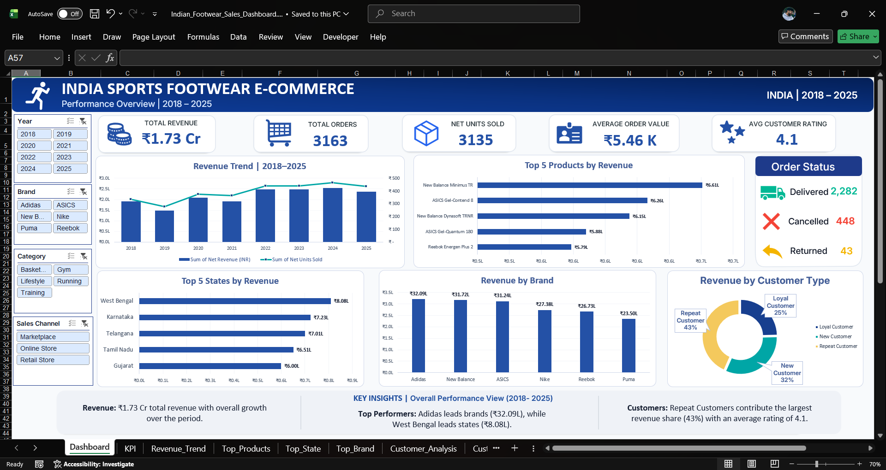

# 🇮🇳 India Sports Footwear E-Commerce Sales Dashboard

### Interactive Microsoft Excel Dashboard | Data Analytics Portfolio Project

---

## 📊 About the Project

An interactive Microsoft Excel dashboard built to analyze India-focused sports footwear e-commerce sales from 2018 to 2025.

The dashboard provides insights into revenue trends, product and brand performance, state-wise sales, customer contribution and order status using PivotTables, PivotCharts, Slicers and KPI cards.

---

## 🔗 Quick Access

| Resource | Link |
|---|---|
| 📊 Excel Dashboard | [Download Excel Dashboard](./Indian_Footwear_Sales_Dashboard.xlsx) |
| 📁 Dataset | [Download Dataset](./Indian_Footwear_Sales_Data.csv) |
| 🖼️ Dashboard Preview | [View Dashboard Image](./DashBoard_Screenshot.png) |
| 📊 Kaggle Dataset | [View on Kaggle](https://www.kaggle.com/datasets/devanshgupta0308/india-sports-footwear-e-commerce-sales-dataset) |
| 📓 Kaggle Notebook | [View Analysis Notebook](https://www.kaggle.com/code/devanshgupta0308/india-sports-footwear-e-commerce-sales-analysis) |

---

## 📑 Table of Contents

- [📊 About the Project](#-about-the-project)
- [🎯 Business Problem](#-business-problem)
- [💡 Solution](#-solution)
- [📈 Key Performance Indicators](#-key-performance-indicators)
- [📊 Dashboard Analysis](#-dashboard-analysis)
- [💡 Key Insights](#-key-insights)
- [🧹 Data Preparation](#-data-preparation)
- [🛠️ Tools & Techniques](#️-tools--techniques)
- [📁 Project Files](#-project-files)
- [📊 Kaggle Resources](#-kaggle-resources)
- [📚 Data Source](#-data-source)
- [🚀 What This Project Demonstrates](#-what-this-project-demonstrates)
- [🔮 Future Scope](#-future-scope)
- [👤 Author](#-author)

---

## 🎯 Business Problem

The raw dataset contained information across products, brands, customers, locations, sales channels and order statuses.

The main challenge was to convert this detailed sales data into a clear business view that could answer questions such as:

- How is revenue performing from 2018 to 2025?
- Which products generate the highest revenue?
- Which brands contribute most to overall revenue?
- Which states show the highest sales performance?
- How much revenue comes from different customer types?
- What is the distribution of delivered, cancelled and returned orders?

---

## 💡 Solution

The data was cleaned, structured and analyzed using Microsoft Excel.

An interactive dashboard was created using:

- PivotTables
- PivotCharts
- Slicers
- KPI Cards
- Excel formulas
- Data formatting
- Interactive filtering
- Business-focused data visualization

The dashboard allows users to filter the analysis by:

- Year
- Brand
- Category
- Sales Channel

---

## 📈 Key Performance Indicators

| KPI | Value |
|---|---:|
| Total Revenue | ₹1.73 Cr |
| Total Orders | 3,163 |
| Net Units Sold | 3,135 |
| Average Order Value | ₹5.46K |
| Average Customer Rating | 4.1 |

---

## 📊 Dashboard Analysis

### 1. Revenue Trend — 2018–2025

A combination chart is used to analyze revenue and net units sold over time.

The analysis shows an overall positive long-term trend with fluctuations across individual years, with revenue reaching its highest level around 2024 followed by a slight decline in 2025.

### 2. Top 5 Products by Revenue

A horizontal bar chart highlights the products generating the highest revenue.

**Top Product:** New Balance Minimus TR — approximately ₹6.61 Lakh.

### 3. Revenue by Brand

The dashboard compares revenue contribution across footwear brands.

**Top Brand:** Adidas — approximately ₹32.09 Lakh.

### 4. Top 5 States by Revenue

The dashboard provides a state-wise comparison of revenue to identify stronger-performing regions.

**Top State among the analyzed top 5:** West Bengal — approximately ₹8.08 Lakh.

Other top-performing states include:

- Karnataka
- Telangana
- Tamil Nadu
- Gujarat

### 5. Revenue by Customer Type

A doughnut chart shows revenue contribution across:

- New Customers
- Repeat Customers
- Loyal Customers

**Revenue contribution:**

- Repeat — 43%
- New — 32%
- Loyal — 25%

> Note: These percentages represent **revenue contribution**, not customer-count share.

### 6. Order Status Analysis

The dashboard summarizes order outcomes across:

- Delivered — 2,282
- Cancelled — 448
- Returned — 433

---

## 💡 Key Insights

- Total revenue reached **₹1.73 Cr** across the analyzed period.
- **Adidas** generated approximately **₹32.09 Lakh** in revenue.
- **New Balance Minimus TR** generated approximately **₹6.61 Lakh**, making it the highest-revenue product.
- **West Bengal** was the highest-performing state among the top 5 states analyzed.
- **Repeat customers contributed 43% of total revenue**.
- Revenue showed an overall positive long-term trend, with fluctuations across individual years.
- Order status analysis shows that delivered orders form the largest portion of recorded orders.

---

## 🧹 Data Preparation

The final dataset contains **3,164 records and 39 columns**, covering sales, product, customer, regional, financial and order-related information from 2018 to 2025.

Key preparation activities included:

- Reviewing and structuring the dataset
- Checking data consistency
- Preparing fields for PivotTable analysis
- Creating calculated and analytical fields
- Formatting revenue and AOV values for readability
- Preparing the dataset for dashboard filtering and visualization

---

## 🛠️ Tools & Techniques

### Tools

- Microsoft Excel
- Git
- GitHub
- Kaggle

### Excel Techniques

- PivotTables
- PivotCharts
- Slicers
- KPI Cards
- Excel formulas
- Data cleaning and formatting
- Conditional formatting
- Dashboard layout and visualization

---

## 📁 Project Files

| File | Description |
|---|---|
| `Indian_Footwear_Sales_Dashboard.xlsx` | Interactive Excel dashboard |
| `Indian_Footwear_Sales_Data.csv` | Final analysis dataset |
| `DashBoard_Screenshot.png` | Dashboard preview image |
| `README.md` | Project documentation |

---

## 📊 Kaggle Resources

### Dataset

**[India Sports Footwear E-Commerce Sales Dataset](https://www.kaggle.com/datasets/devanshgupta0308/india-sports-footwear-e-commerce-sales-dataset)**

### Analysis Notebook

**[India Sports Footwear E-Commerce Sales Analysis](https://www.kaggle.com/code/devanshgupta0308/india-sports-footwear-e-commerce-sales-analysis)**

---

## 📚 Data Source

This project uses a modified and India-focused version of the original **Sports Footwear Sales & Consumer Behavior** dataset by **aliiihussain** on Kaggle.

**Original Dataset:**  
https://www.kaggle.com/datasets/aliiihussain/sports-footwear-sales-and-consumer-behavior

The original dataset contained global sports footwear sales and consumer behavior data.

For this project, the dataset was substantially modified to create an India-focused e-commerce sales dataset. The modifications include regional adaptation, additional fields, restructuring of the dataset and adjustments for business-focused sales analysis.

---

## 🚀 What This Project Demonstrates

This project demonstrates practical experience in:

- Cleaning and preparing structured sales data
- Building KPI-driven dashboards
- Using PivotTables and PivotCharts for analysis
- Creating interactive dashboards with Slicers
- Analyzing sales trends and business performance
- Performing product, brand and regional analysis
- Understanding customer revenue contribution
- Presenting analytical findings in a business-friendly format

---

## 🔮 Future Scope

Potential extensions for this project include:

- Rebuilding the dashboard using Power BI
- Connecting the analysis with SQL
- Automating data refresh and reporting
- Adding advanced customer segmentation
- Developing forecasting and predictive analysis

---

## 👤 Author

**Devansh Gupta**

B.Tech Computer Science | Aspiring Data Analyst

Focused on Excel, SQL, Python, Power BI and Data Visualization.

🔗 **Kaggle:** [devanshgupta0308](https://www.kaggle.com/devanshgupta0308)

🔗 **Linkedin:** [DevanshGupta](https://www.linkedin.com/in/devansh-gupta-90aa14233)

---

⭐ If you find this project useful, feel free to explore the dashboard, dataset and Kaggle analysis.
