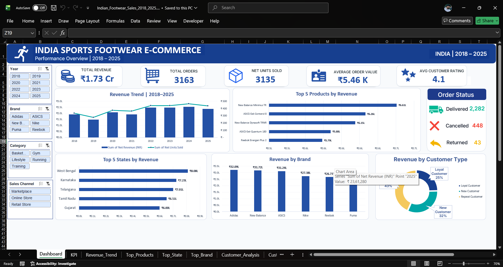

# 🇮🇳 Indian Sports Footwear E-Commerce Sales Dashboard

### Interactive Excel Dashboard | Data Analytics Portfolio Project

---

## 📊 Project Overview

This project is an India-focused sports footwear e-commerce sales analysis built using Microsoft Excel.

The project was developed in two versions. The initial version was created as an early analytical dashboard and was later reviewed, tested and improved based on the limitations identified in the first version.

This repository contains the **improved and tested version** of the project.

The dataset was cleaned, transformed and adapted into an India-focused business scenario to create a structured environment for sales and customer analysis.

The final output is an interactive Excel dashboard designed to provide a consolidated view of:

- Sales performance
- Revenue trends
- Product performance
- Brand performance
- Geographic performance
- Customer segments
- Order status

The dashboard uses PivotTables, PivotCharts, KPI cards and interactive slicers to allow users to explore the data dynamically.

---

## 🔄 Project Evolution

This project is an improved and refined version of an earlier Excel dashboard project.

The first version was developed as an initial analytical build and helped establish the overall dashboard structure, KPI framework and visualization approach.

After reviewing and testing the initial version, the project was reworked to improve the dataset, analytical structure, dashboard reliability, readability and overall presentation.

### Version 1 — Initial Dashboard

The first version served as the initial implementation of the project.

It helped establish:

- Initial dataset structure
- Dashboard layout
- KPI framework
- PivotTable analysis
- PivotChart visualizations
- Interactive slicers
- Initial business analysis

However, the initial version had limitations in areas such as data completeness, analytical structure and some dashboard implementations.

### Version 2 — Improved & Tested Dashboard

This repository contains the improved version.

The second version focuses on:

- Refined dataset structure
- Improved analytical fields
- Better dashboard organization
- Validated KPI calculations
- Improved order-status handling
- Improved data readability
- Tested interactive slicers
- Refined chart formatting
- Improved dashboard presentation

The objective was not simply to recreate the first dashboard, but to use the first version as a learning and testing stage and build a more reliable final version.

---

## 📌 Version Comparison

| Area | Initial Version | Improved Version |
|---|---|---|
| Dataset | Initial dataset | Refined and improved dataset |
| Data Structure | Initial analytical structure | Improved analytical structure |
| Dashboard | Initial dashboard build | Refined interactive dashboard |
| KPI Implementation | Initial KPI setup | Validated dynamic KPIs |
| Slicers | Initial implementation | Tested interactive filtering |
| Order Status | Initial implementation | Improved handling and display |
| Data Readability | Basic formatting | Improved readability |
| Visualization | Initial chart design | Refined chart presentation |
| Testing | Initial testing | Extensive dashboard testing |
| Portfolio Presentation | Initial project | Final improved version |

---

## 🎯 Business Objectives

The dashboard was designed to answer key business questions such as:

- How has revenue changed from 2018 to 2025?
- Which products generate the highest revenue?
- Which brands contribute the most revenue?
- Which Indian states generate the highest revenue?
- How is revenue distributed across different customer types?
- What are the overall sales performance indicators?
- How does performance change across different years, brands, categories and sales channels?
- What is the distribution of order statuses?

---

## 📌 Key Performance Indicators

| KPI | Overall Value |
|---|---:|
| Total Revenue | ₹1.73 Cr |
| Total Orders | 3,163 |
| Net Units Sold | 3,135 |
| Average Order Value | ₹5.46K |
| Average Customer Rating | 4.1 / 5 |

> KPI values are dynamic and change based on the selected dashboard slicers.

---

## 📈 Dashboard Features

The interactive dashboard includes:

- Revenue Trend from 2018–2025
- Top 5 Products by Revenue
- Top 5 States by Revenue
- Revenue by Brand
- Revenue by Customer Type
- Order Status summary
- Dynamic KPI cards
- Year slicer
- Brand slicer
- Category slicer
- Sales Channel slicer
- PivotTables
- PivotCharts
- Custom number formatting
- Interactive dashboard filtering

---

## 📊 Dashboard Visualizations

### 1. Revenue Trend | 2018–2025

A combination chart showing yearly revenue performance along with net units sold.

The chart helps compare the movement of revenue and unit sales across the analyzed period.

**Why this chart?**

A time-based visualization makes it easier to identify changes in sales performance and understand the overall direction of the business over multiple years.

---

### 2. Top 5 Products by Revenue

A horizontal bar chart showing the five highest-revenue-generating products.

**Why this chart?**

A horizontal bar chart makes product names easier to read and provides a clear ranking of the strongest-performing products.

---

### 3. Revenue by Customer Type

A doughnut chart showing revenue contribution across:

- Loyal Customers
- New Customers
- Repeat Customers

**Why this chart?**

The doughnut chart provides a quick visual comparison of how different customer segments contribute to overall revenue.

---

### 4. Top 5 States by Revenue

A horizontal bar chart showing the five highest-revenue-generating Indian states.

**Why this chart?**

The horizontal format makes state names easy to read while allowing quick comparison between the top-performing geographic markets.

---

### 5. Revenue by Brand

A column chart comparing revenue generated by the footwear brands included in the dataset.

**Why this chart?**

A column chart provides a straightforward comparison of brand-level revenue performance and makes differences between brands easy to identify.

---

### 6. Order Status

The dashboard includes an order-status summary covering:

- Delivered
- Cancelled
- Returned

**Why this section?**

Order status provides additional operational context beyond revenue and sales performance, helping understand how orders are distributed across different outcomes.

---

## 🎛️ Interactive Dashboard Controls

The dashboard includes four interactive slicers:

### Year

Allows users to analyze performance for specific years from 2018 to 2025.

### Brand

Allows users to filter the dashboard based on individual footwear brands.

### Category

Allows users to analyze different product categories.

### Sales Channel

Allows users to compare performance across different sales channels.

These slicers dynamically update the connected KPI cards and PivotCharts.

---

## 🔍 Key Business Insights

The dashboard can be used to identify:

- Long-term revenue trends
- Changes in yearly sales performance
- High-performing products
- Strong-performing footwear brands
- High-revenue geographic markets
- Customer segment contribution
- Order outcome distribution
- Differences in performance across sales channels
- Changes in KPIs based on selected filters

> Since the dashboard is interactive, the insights can change depending on the selected slicer combinations.

---

## 🧹 Data Preparation

The dataset was prepared before building the dashboard.

Major preparation activities included:

- Reviewing and cleaning the source data
- Structuring sales-related information
- Adapting the dataset to an India-focused business scenario
- Organizing product, brand and category information
- Preparing customer-related fields
- Adding Indian geographic dimensions
- Structuring order-status information
- Preparing the data for PivotTable analysis
- Creating dashboard-ready analytical fields
- Validating the dataset before visualization

The final dataset contains **3,163 records and 27 columns** covering the period from **2018 to 2025**.

---

## 🗂️ Dataset Overview

The dataset contains sales, customer, product and order-related information used to build the dashboard.

Major analytical dimensions include:

- Order information
- Customer information
- Product information
- Brand
- Category
- Order date
- Geographic information
- Sales channel
- Customer type
- Order status
- Revenue
- Units sold
- Customer rating

This structure allows the dataset to be analyzed from multiple business perspectives.

---

## 🛠️ Tools & Techniques

### Tools

- Microsoft Excel
- Git
- GitHub

### Excel Techniques

- Data Cleaning
- Data Transformation
- PivotTables
- PivotCharts
- Slicers
- KPI Cards
- Custom Number Formatting
- Data Visualization
- Dashboard Design
- Business Analysis

---

## 📂 Project Files

| File | Description |
|---|---|
| `Indian_Footwear_Sales_Dashboard.xlsx` | Final Excel workbook containing the interactive dashboard and analysis |
| `Indian_Footwear_Sales_Data.csv` | Dataset used for the dashboard analysis |
| `Dashboard_Screenshot.png` | Preview image of the completed dashboard |

---

## 📚 Data Source

The project started with a publicly available sports footwear sales dataset.

The source data was subsequently cleaned, transformed and adapted into an India-focused analytical dataset for this project.

The dataset and dashboard in this repository represent an adapted analytical scenario created for learning, portfolio development and data analytics practice.

> This project should not be treated as official Indian sports footwear market data or as a representation of actual company performance.

---

## 💡 What This Project Demonstrates

This project demonstrates practical skills in:

- Excel-based data analysis
- Interactive dashboard development
- KPI design
- PivotTable and PivotChart analysis
- Slicer-based interactive reporting
- Data cleaning and transformation
- Business-oriented data visualization
- Sales performance analysis
- Product and brand analysis
- Customer analysis
- Geographic sales analysis
- Order-status analysis
- Dashboard testing and validation
- Presenting analytical results professionally

---

## 🚀 Project Outcome

The final dashboard provides an interactive overview of Indian sports footwear e-commerce performance.

Instead of analyzing individual tables or raw data, users can use the dashboard to quickly explore:

**Revenue → Products → Brands → States → Customers → Order Status**

while dynamically filtering the analysis using the available slicers.

The project also demonstrates an iterative analytics workflow:

**Initial Build → Testing → Identify Limitations → Improve Dataset → Refine Dashboard → Validate → Final Version**

This approach reflects how an analytical project can evolve through testing and refinement rather than being treated as a one-time dashboard build.

---

## 🔮 Future Improvements

Potential future improvements include:

- Monthly and quarterly sales analysis
- Profit and margin analysis
- Customer retention analysis
- Advanced Excel-based measures
- Power BI implementation
- SQL-based analysis
- Automated reporting

---

## 👤 Author

**Devansh Gupta**

Data Analytics Portfolio Project

---

## 🔗 Project Versions

### Initial Version

**Repository:** `DevanshGupta03/Indian-Footwear-Sales-Dashboard`

The initial version of the project, developed as the first stage of the dashboard and analytics workflow.

### Improved Version

**Repository:** `DevanshGupta03/Indian-Footwear-Sales-Dashboard`

This repository contains the improved, refined and tested version of the project.

---

⭐ If you find this project useful, feel free to explore the dashboard and dataset.
